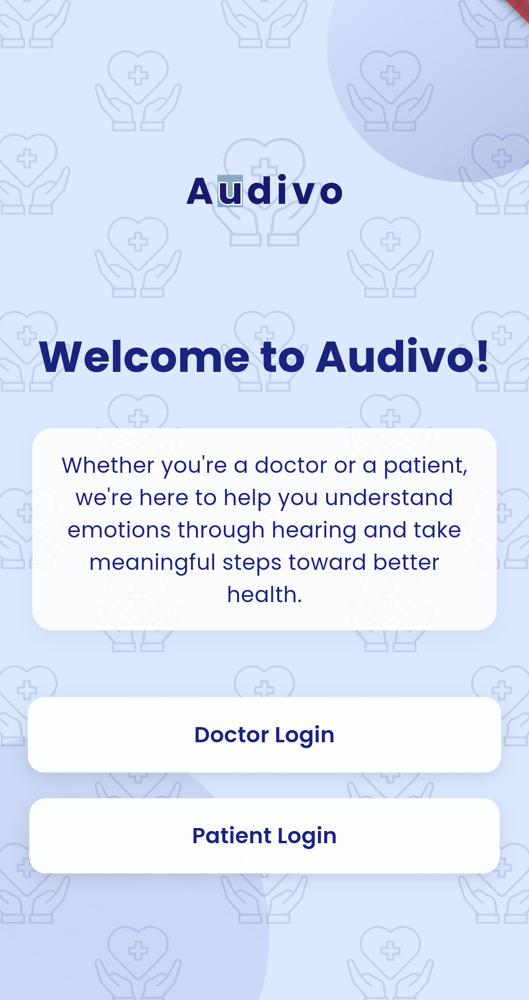
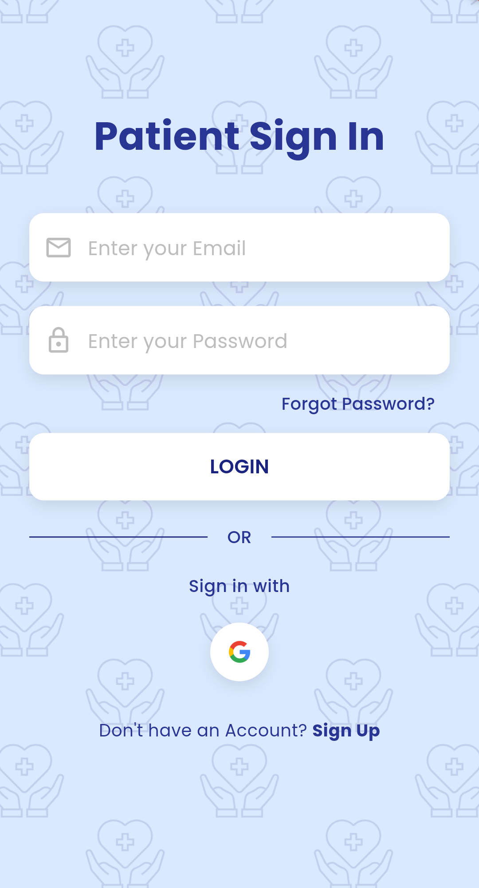
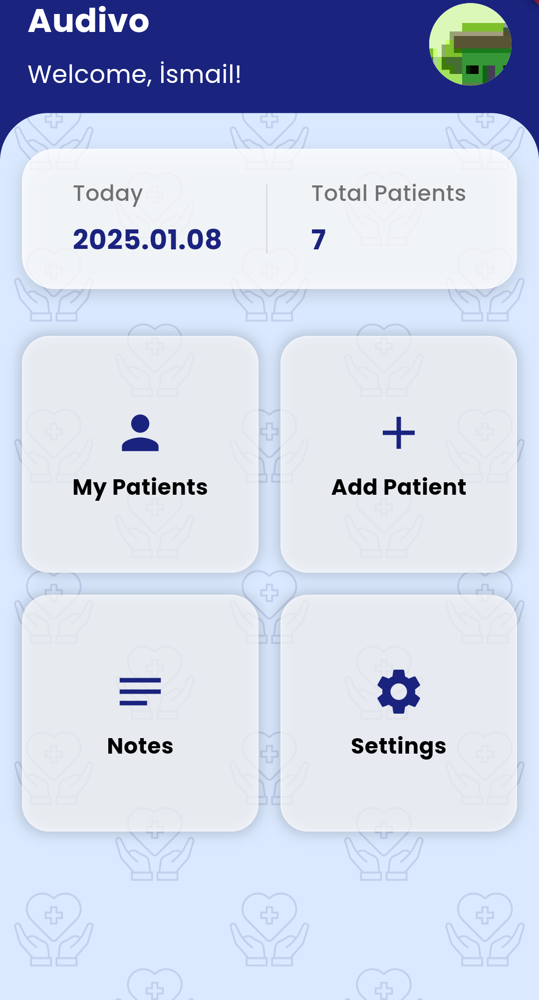
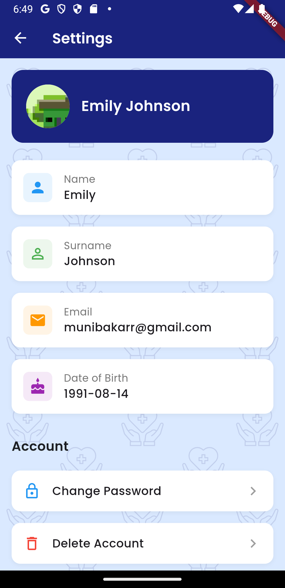
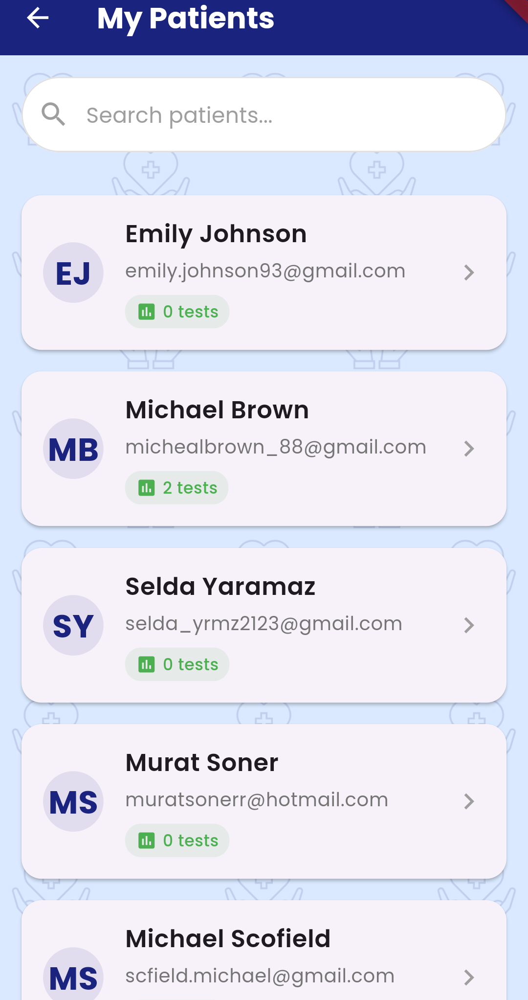
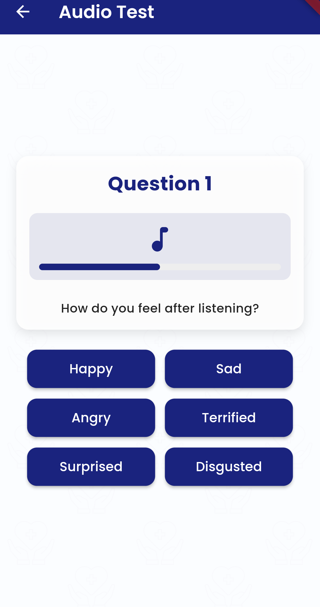
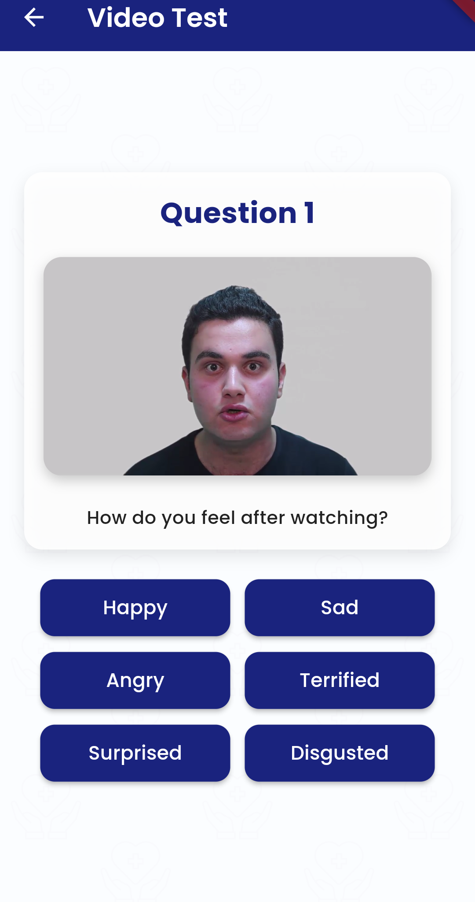
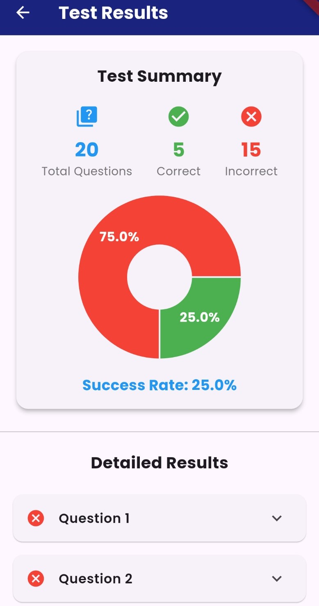

# AUDIVO

[](https://flutter.dev)
[](https://firebase.google.com)
[](https://dart.dev)

## 📱 Proje Hakkında | About Project

TR: Bu mobil uygulama, kullancıların ses ve videodan duygu tanıma analizi yapmaları için tasarlanmıştır. Doktor ve hasta rollerine sahip kullanıcılar için özel olarak tasarlanmış arayüzler içerir.

EN: This mobile application is designed for users to perform emotion recognition analysis on audio and video. It includes interfaces specifically designed for users with doctor and patient roles.


## 🚀 Özellikler | Features

### 👨‍⚕️ Doktor Özellikleri | Doctor Features
- Hasta yönetimi | Patient management
- Test sonuçlarını görüntüleme | View test results
- Hasta notları oluşturma | Create patient notes
- Test uygulama | Testing application

### 👤 Hasta Özellikleri | Patient Features
- Duygu analiz testleri | Emotion analysis tests
- Video ve ses tabanlı değerlendirmeler | Video and audio-based assessments
- Test sonuçlarını görüntüleme | View test results

## 🛠️ Teknolojiler | Technologies

- Flutter
- Firebase Authentication
- Cloud Firestore
- Firebase Storage
- Google Sign-In
- Video Player
- Audio Players
- FL Chart
- Table Calendar

## 📋 Gereksinimler | Requirements

- Flutter SDK >=3.5.0
- Dart SDK >=3.5.0
- Firebase hesabı | Firebase account
- Android Studio / VS Code

## 🔧 Kurulum | Installation

### 1. Projeyi Klonlayın | Clone the Project
```bash
git clone [repository-url]
```

### 2. Bağımlılıkları Yükleyin | Install Dependencies
```bash
flutter pub get
```

### 3. Firebase Kurulumu | Firebase Setup

TR: Firebase projenizi oluşturun ve yapılandırın:
EN: Create and configure your Firebase project:

1. [Firebase Console](https://console.firebase.google.com/) üzerinden yeni proje oluşturun | Create new project from Firebase Console
2. Android/iOS uygulamanızı kaydedin | Register your Android/iOS app
   - `google-services.json` dosyasını `android/app/` dizinine ekleyin | Add `google-services.json` to `android/app/` directory
   - `GoogleService-Info.plist` dosyasını `ios/Runner/` dizinine ekleyin | Add `GoogleService-Info.plist` to `ios/Runner/` directory
3. Firebase Authentication'ı etkinleştirin | Enable Firebase Authentication:
   - Email/Password
   - Google Sign-In
4. Cloud Firestore'u oluşturun | Create Cloud Firestore
5. Firebase CLI kurun | Install Firebase CLI:
```bash
npm install -g firebase-tools
firebase login
firebase init
```

### 4. Google Sign-In Yapılandırması | Google Sign-In Configuration
TR: Google Cloud Console'da OAuth 2.0 istemci kimliklerini yapılandırın
EN: Configure OAuth 2.0 client IDs in Google Cloud Console

### 5. Uygulamayı Çalıştırın | Run the Application
```bash
flutter run
```

### ⚠️ Güvenlik Notları | Security Notes
TR: Firebase yapılandırma dosyalarını (`google-services.json`, `GoogleService-Info.plist`) ve API anahtarlarını gizli tutun.
EN: Keep Firebase configuration files (`google-services.json`, `GoogleService-Info.plist`) and API keys private.

## 📱 Ekran Görüntüleri | Screenshots

<div align="center">
  
  
  
  
  
  
  
  
  
</div>

## 🤝 Katkıda Bulunma | Contributing

1. Fork the Project
2. Create your Feature Branch (`git checkout -b feature/AmazingFeature`)
3. Commit your Changes (`git commit -m 'Add some AmazingFeature'`)
4. Push to the Branch (`git push origin feature/AmazingFeature`)
5. Open a Pull Request

## 👥 Geliştiriciler | Developers

### Takım | Team
- [Ela Semra Sava](https://github.com/elassava/)
  - 📧 Email: elassavaa@gmail.com
  - 💼 Role: Project Co-Developer (Eşit Katkı Sağlayıcı | Equal Contributor)

- [Münib Akar](https://github.com/munibakar)
  - 📧 Email: munibakarr@gmail.com
  - 💼 Role: Project Co-Developer (Eşit Katkı Sağlayıcı | Equal Contributor)

 
## 📞 İletişim | Contact

Proje Linki | Project Link: [https://github.com/elassava/emotion-recognition-mobile](https://github.com/elassava/emotion-recognition-mobile)


