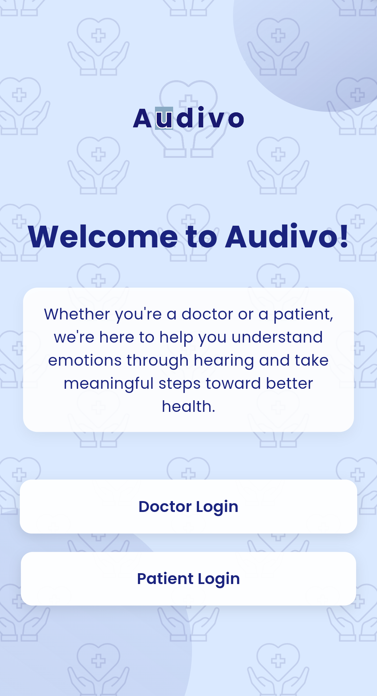

# AUDIVO

[](https://flutter.dev)
[](https://firebase.google.com)
[](https://dart.dev)

## 📱 Proje Hakkında | About Project

TR: Bu mobil uygulama, kullancıların ses ve videodan duygu tanıma analizi yapmaları için tasarlanmıştır. Doktor ve hasta rollerine sahip kullanıcılar için özel olarak tasarlanmış arayüzler içerir.

EN: This mobile application is designed for users to perform emotion recognition analysis on audio and video. It includes interfaces specifically designed for users with doctor and patient roles.


## 🚀 Özellikler | Features

### 👨‍⚕️ Doktor Özellikleri | Doctor Features
- Hasta yönetimi | Patient management
- Test sonuçlarını görüntüleme | View test results
- Hasta notları oluşturma | Create patient notes
- Test uygulama | Testing application

### 👤 Hasta Özellikleri | Patient Features
- Duygu analiz testleri | Emotion analysis tests
- Video ve ses tabanlı değerlendirmeler | Video and audio-based assessments
- Test sonuçlarını görüntüleme | View test results

## 🛠️ Teknolojiler | Technologies

- Flutter
- Firebase Authentication
- Cloud Firestore
- Firebase Storage
- Google Sign-In
- Video Player
- Audio Players
- FL Chart
- Table Calendar

## 📋 Gereksinimler | Requirements

- Flutter SDK >=3.5.0
- Dart SDK >=3.5.0
- Firebase hesabı | Firebase account
- Android Studio / VS Code

## 🔧 Kurulum | Installation

1. Projeyi klonlayın | Clone the project
```bash
git clone [repository-url]
```

2. Bağımlılıkları yükleyin | Install dependencies
```bash
flutter pub get
```

3. Firebase yapılandırmasını ekleyin | Add Firebase configuration
- google-services.json (Android)
- GoogleService-Info.plist (iOS)

4. Uygulamayı çalıştırın | Run the application
```bash
flutter run
```

## 📱 Ekran Görüntüleri | Screenshots

<div align="center">
  
  
  
  
  
  
  
  
  
</div>

## 🤝 Katkıda Bulunma | Contributing

1. Fork the Project
2. Create your Feature Branch (`git checkout -b feature/AmazingFeature`)
3. Commit your Changes (`git commit -m 'Add some AmazingFeature'`)
4. Push to the Branch (`git push origin feature/AmazingFeature`)
5. Open a Pull Request

## 👥 Geliştiriciler | Developers

### Takım | Team
- [Ela Semra Sava](https://github.com/elassava/)
  - 📧 Email: elassavaa@gmail.com
  - 💼 Role: Project Co-Developer (Eşit Katkı Sağlayıcı | Equal Contributor)

- [Münib Akar](https://github.com/munibakar)
  - 📧 Email: munibakarr@gmail.com
  - 💼 Role: Project Co-Developer (Eşit Katkı Sağlayıcı | Equal Contributor)

 
## 📞 İletişim | Contact

Proje Linki | Project Link: [https://github.com/elassava/emotion-recognition-mobile](https://github.com/elassava/emotion-recognition-mobile)

